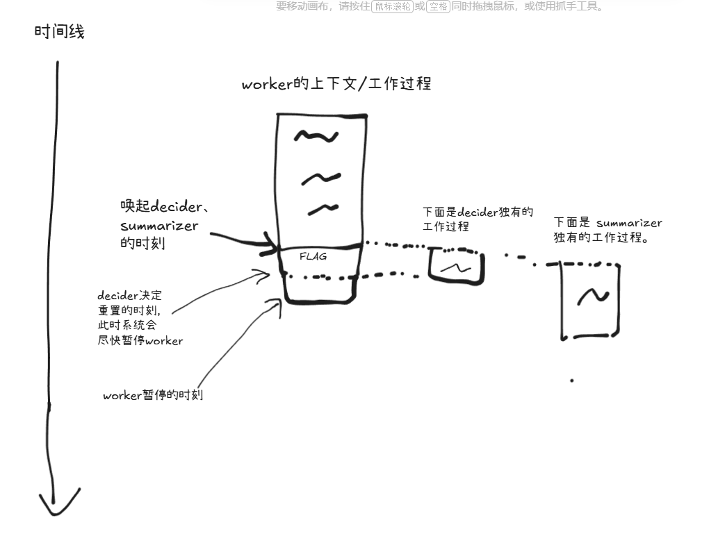
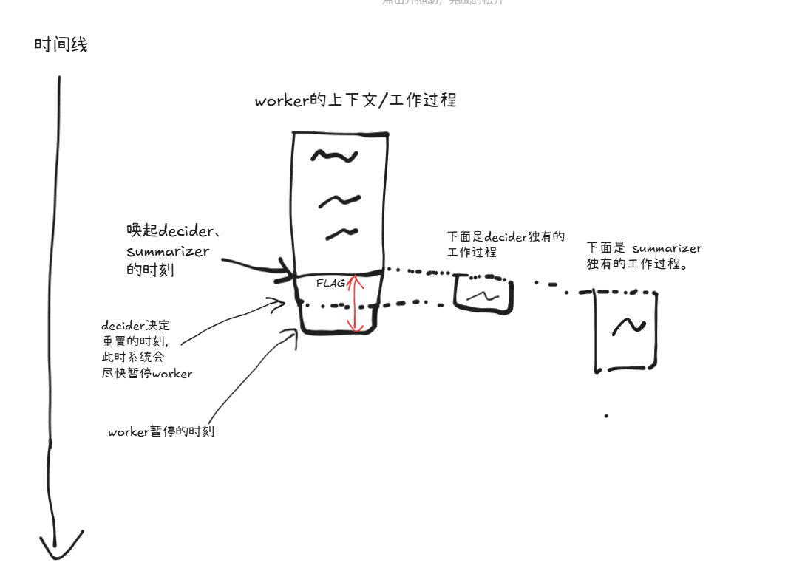

# 记忆机制讲解

本 Agent 系统的重点是记忆机制，任务执行和记忆分离。系统分为3个角色：worker（干活）、summarizer（做摘要）、decider（判断是否要重置上下文）

这么设计基于两个理由：
1. 拆分任务能减轻AI的注意力压力，从而达到更好的效果（AI工程的基本原则之一）
2. 人脑的（至少大部分的）记忆都是在后台自动完成摘要、重置的

建议先阅读一下 `src/core/init_prompts.py` 中的 `_build_codex_user_level_instruction` 以及 `src/core/memory_manager.py` 中的 `build_summarizer_instruction` 和 `build_decider_instruction` ，先留个大概的印象。

worker的上下文每增长3%，系统就自动从worker的上下文中fork一个summarizer和decider出来（利用缓存），worker不会暂停，而是会继续运行（就像人脑一样），这个设计会带来一些问题，后面会讲解决方法。

在fork summarizer出来**之后**，系统会在worker的上下文中留一个 WAKE_SUMMARIZER_FLAG，注意这里是**之后**，这个新加入的flag在当前刚fork出来的summarizer的上下文中是不存在的，这个flag是给下一次被唤醒的summarizer服务的（具体作用在`build_summarizer_instruction`里面有说明）

边界情况之一：上一个summarizer还没跑完，现在又到了一个触发summarizer的节点，这个时候就不要再新开一个summarizer，而是等到下次触发再说。

系统检测到decider决定要重置上下文的信号后，就会暂停worker（在执行完worker的tool call，系统append了tool msg之后暂停运行）





红线划定的部分，是没有被摘要的，要把它放到新的上下文里面。原本的设计是打算再触发一次摘要。但是通常来说decider做决定不需要很长时间的，这期间 Worker 的上下文大概率不会增长很多，所以做摘要的话，就有点浪费了（哪怕用了缓存）

如果decider发出了重置的信号，但是summarizer还没跑完，decider就要等它跑完。

不能等到decider决定重置后再做摘要吗，这样更省token？理论上可以，我之前在codex（gpt5.2）上也是等到我认为要重置了，才让它做摘要的，但是发现它会遗漏一些东西

预计一年后，等大模型价格大幅下降了，可以调整成worker每工作五轮就唤起一次summarizer/decider，甚至每工作一轮就唤起一次summarizer（就像人脑那么频繁）

# 建议阅读顺序：

1. src/core/init_prompts.py 和 src/core/memory_manager.py
2. src/core/agent.py，Pycharm里面点击Structure, VSCode里面点击Outline来查看 Agent 对外暴露了什么接口。核心是 run()
3. src/core/agent_runner.py：主要是为了照顾steer conversation功能，保证agent在有多条steer msg进来的时候，只运行一个agent，防止重入。 
4. src/web_app.py
5. src/websocket_chat_session.py

# 文档

- AGENTS.md 大致讲述项目的结构。
- docs/feature-decisions.md 产品功能决策
- docs/draft-plans 我自己写的初步计划
- docs/plans AI基于初步计划制定的计划
- docs/code_explanations 让 AI 给我解释的一些代码，对其他人应该没啥用。用 [structured-knowledge](https://github.com/jenglong1899/structured-knowledge) skill 制作

你可能需要把 AGENTS.md 中的 `# 用户开发环境` 一节给删掉

# 启动

默认用codex订阅，如果要用其他，需要设置环境变量
```
cd backend
cp .env.example .env
```

Linux/macOS:

```
chmod +x dev.sh
./dev.sh
```

用Codex可能需要设置环境变量来走代理，但Pycharm的run configuration不会展开环境变量里面的字面量，所以会导致代理设置失效，
可以run configuration里面设置这个环境变量：key是`PROJECT_X_CODEX_HTTP_PROXY`，value是`socks5h://172.17.16.1:7890`（如果你的vpn是7890端口）
